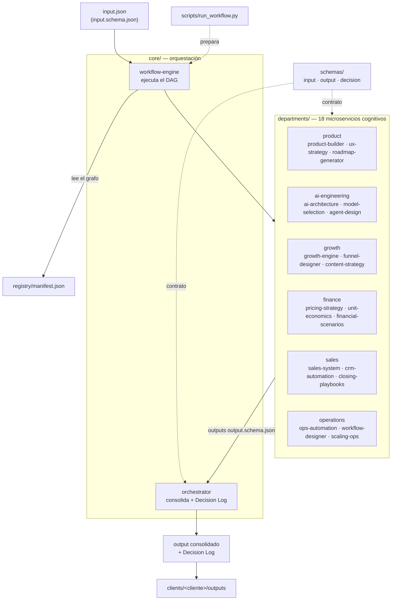
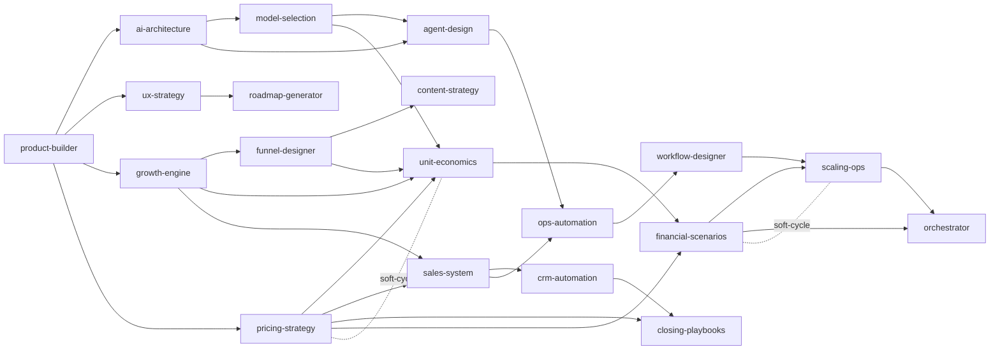
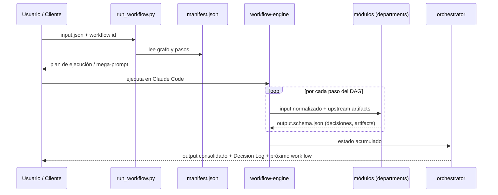

# Arquitectura global del AI Agency Prompt OS

Vista de conjunto de cómo encajan las piezas: un `input` normalizado entra, recorre módulos
especializados orquestados sobre un grafo declarativo, y sale un resultado consolidado por cliente.

---

## 1. Diagrama de capas (flujo principal)

---

## 2. Grafo de dependencias entre módulos (DAG)

Cada módulo declara `consumes` / `feeds`. El `workflow-engine` lo ordena topológicamente.

Las líneas punteadas `soft-cycle` son relaciones bidireccionales resueltas por **iteración**
(no por recursión): el orquestador puede re-disparar un módulo con feedback del downstream.

---

## 3. Ciclo de ejecución (de input a entrega)

---

## 4. Mapa de carpetas → responsabilidad

| Carpeta | Responsabilidad |
|---------|-----------------|
| `core/` | Orquestación: descomponer, ejecutar el grafo, consolidar, registrar decisiones. |
| `departments/` | 18 prompts especializados, cada uno una función pura con contrato estable. |
| `workflows/` | Encadenamientos declarativos de módulos (DAGs con gating). |
| `schemas/` | Contratos de I/O (input · output · decision) que garantizan la compatibilidad. |
| `registry/` | `manifest.json` (máquina) + index, dependency-map y versionado (humano). |
| `scripts/` | `validate.py` (integridad en CI) y `run_workflow.py` (manifiesto → plan ejecutable). |
| `examples/` | Ejecuciones de referencia end-to-end. |
| `clients/` | Un `input` por cliente; outputs y Decision Log aislados (ver Agency Playbook). |
| `docs/` | Playbook de agencia y esta arquitectura. |
