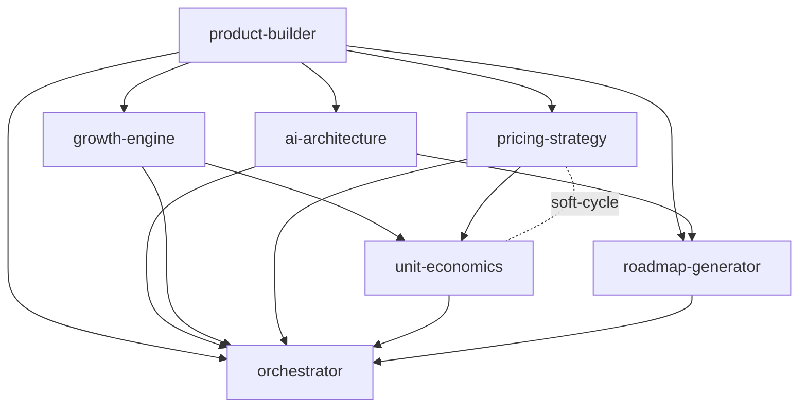

# Workflow — Blueprint MVP (Compiler de ACOS)

> Subconjunto de `full-business-build` que produce un *AI-Business Blueprint* mínimo:
> market/product, arquitectura de IA, crecimiento, modelo de negocio/pricing, unit-economics y roadmap.
> Es el pipeline del **MVP del Compiler de ACOS** (ver [`docs/integration-acos.md`](../docs/integration-acos.md)).

## 🧬 Metadata
| Campo | Valor |
| --- | --- |
| `id` | `blueprint-mvp` |
| `version` | `v1.0` |
| `engine` | `core/workflow-engine` |
| `final_merge` | `core/orchestrator` |

## 🎯 Objetivo
De un `input.json` (idea + objetivo + restricciones) a un blueprint consolidado y exportable, en el
mínimo de pasos: lo justo para validar y vender, sin sales/ops aún.

## 🔗 Secuencia (DAG)

| # | Módulo | Consume | Produce (clave) |
|---|--------|---------|-----------------|
| 1 | `product-builder` | — | `value_proposition`, `mvp_scope`, `icp` |
| 2 | `ai-architecture` | 1 | `pattern`, `components`, `nfr` |
| 3 | `growth-engine` | 1 | `growth_model`, `primary_channels` |
| 4 | `pricing-strategy` | 1 | `pricing_model`, `tiers` |
| 5 | `unit-economics` | 3,4 | `ltv_cac_ratio`, `gross_margin` |
| 6 | `roadmap-generator` | 1,2 | `phases`, `milestones` |
| 7 | `orchestrator` | 1–6 | blueprint consolidado + Decision Log |

## 🛑 Gating
`unit-economics` actúa como gate: si `ltv_cac_ratio < 3` o `payback_months > 18`, el orquestador
marca `needs_human_decision` antes de presentar el blueprint como "validado".

## ✅ Resultado esperado
Blueprint con: producto/ICP, arquitectura de IA, motor de crecimiento, modelo de pricing,
unit-economics estimado y roadmap por fases — listo para que el **Exporter de ACOS** lo renderice.

## 🚀 Post-MVP
Activar más capacidad = añadir módulos al pipeline (`sales-system`, `ops-automation`,
`financial-scenarios`, `content-strategy`, `agent-design`, …). Ya están escritos en `departments/`.
