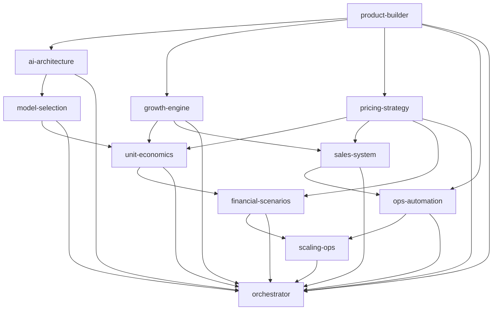

# Workflow — Full Business Build

> Diseña una empresa de IA completa de extremo a extremo. Ejecutado por `core/workflow-engine`
> y consolidado por `core/orchestrator`.

## 🧬 Metadata
| Campo | Valor |
| --- | --- |
| `id` | `full-business-build` |
| `version` | `v1.0` |
| `engine` | `core/workflow-engine` |
| `final_merge` | `core/orchestrator` |

## 🎯 Objetivo
De un `business_context` + `objective` a un plan de negocio integrado: producto, arquitectura IA,
crecimiento, ventas, operaciones y finanzas — con decisiones consolidadas y conflictos resueltos.

## 🔗 Secuencia (DAG)

| # | Módulo | Consume | Produce (clave) |
|---|--------|---------|-----------------|
| 1 | `product-builder` | — | `value_proposition`, `mvp_scope`, `icp` |
| 2 | `ai-architecture` | 1 | `pattern`, `components`, `nfr` |
| 3 | `model-selection` | 2 | `task_model_map`, `cost_per_request` |
| 4 | `growth-engine` | 1 | `growth_model`, `primary_channels` |
| 5 | `pricing-strategy` | 1 | `pricing_model`, `tiers` |
| 6 | `unit-economics` | 3,4,5 | `ltv_cac_ratio`, `gross_margin` |
| 7 | `sales-system` | 4,5 | `sales_model`, `pipeline_stages` |
| 8 | `ops-automation` | 1,7 | `core_processes`, `automation_map` |
| 9 | `financial-scenarios` | 5,6 | `scenarios`, `capital_need` |
| 10 | `scaling-ops` | 8,9 | `scaling_plan`, `hiring_plan` |
| 11 | `orchestrator` | 1–10 | merge final + Decision Log |

## 🛑 Gating
Si cualquier paso devuelve `status ∈ {blocked, needs_human_decision}`, el engine se detiene y el
orchestrator emite estado `partial` con las decisiones humanas requeridas.

## ✅ Resultado esperado
Output del `orchestrator` con: resumen ejecutivo, decisiones consolidadas, outputs por departamento,
conflictos resueltos, recomendación final y próximo workflow sugerido (típicamente `growth-loop`).
