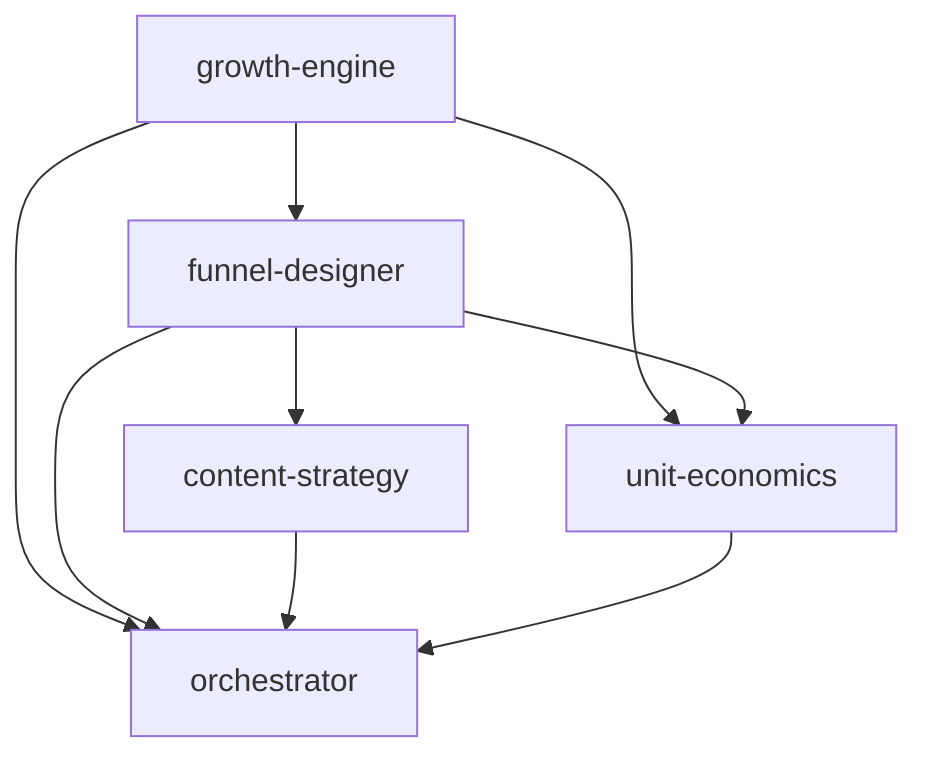

# Workflow — Growth Loop

> Diseña el sistema de crecimiento end-to-end y valida su economía. Ejecutado por
> `core/workflow-engine`, consolidado por `core/orchestrator`.

## 🧬 Metadata
| Campo | Valor |
| --- | --- |
| `id` | `growth-loop` |
| `version` | `v1.0` |
| `engine` | `core/workflow-engine` |
| `final_merge` | `core/orchestrator` |

## 🎯 Objetivo
A partir de un producto definido, construir el motor de crecimiento (modelo, funnel, contenido) y
verificar que el unit economics lo sostiene antes de escalar inversión.

## 🔗 Secuencia (DAG)

| # | Módulo | Consume | Produce (clave) |
|---|--------|---------|-----------------|
| 1 | `growth-engine` | `product-builder`* | `growth_model`, `primary_channels` |
| 2 | `funnel-designer` | 1 | `stages`, `tracking_events` |
| 3 | `content-strategy` | 1,2 | `pillars`, `distribution_engine` |
| 4 | `unit-economics` | 1,2, `pricing-strategy`* | `ltv_cac_ratio`, `payback_months` |
| 5 | `orchestrator` | 1–4 | merge + decisión de escalar/no |

\* `product-builder` y `pricing-strategy` se consumen como upstream si existen en el estado; si no,
el workflow los marca como dependencia faltante (input requerido).

## 🛑 Gating
El paso `unit-economics` actúa como **gate económico**: si `ltv_cac_ratio < 3` o `payback_months > 18`,
el orchestrator marca `needs_human_decision` antes de recomendar escalar gasto.

## ✅ Resultado esperado
Motor de crecimiento accionable + veredicto de viabilidad económica + experimentos priorizados.
