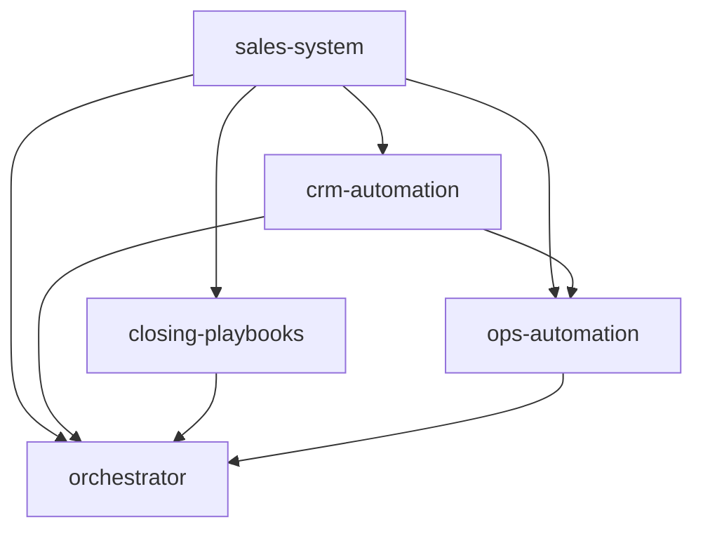

# Workflow — Sales Funnel

> Construye un sistema de ventas automatizado de extremo a extremo. Ejecutado por
> `core/workflow-engine`, consolidado por `core/orchestrator`.

## 🧬 Metadata
| Campo | Valor |
| --- | --- |
| `id` | `sales-funnel` |
| `version` | `v1.0` |
| `engine` | `core/workflow-engine` |
| `final_merge` | `core/orchestrator` |

## 🎯 Objetivo
De un funnel de growth y un modelo de precios, producir un motor comercial completo: sistema de
ventas, automatización CRM y playbooks de cierre, listos para operar.

## 🔗 Secuencia (DAG)

| # | Módulo | Consume | Produce (clave) |
|---|--------|---------|-----------------|
| 1 | `sales-system` | `funnel-designer`*, `pricing-strategy`* | `sales_model`, `pipeline_stages` |
| 2 | `crm-automation` | 1 | `automations`, `lead_scoring` |
| 3 | `closing-playbooks` | 1, `pricing-strategy`* | `objection_handlers`, `closing_sequences` |
| 4 | `ops-automation` | 1,2 | `core_processes`, `automation_map` |
| 5 | `orchestrator` | 1–4 | merge final |

\* upstream consumido del estado del workflow si está disponible.

## 🛑 Gating
Si `sales-system` detecta incoherencia entre `pricing_model` y el modelo de ventas (ej. field sales
para ticket bajo), devuelve `needs_human_decision` y el engine se detiene.

## ✅ Resultado esperado
Pipeline definido + automatizaciones CRM + playbooks de cierre + procesos operativos de ventas.
